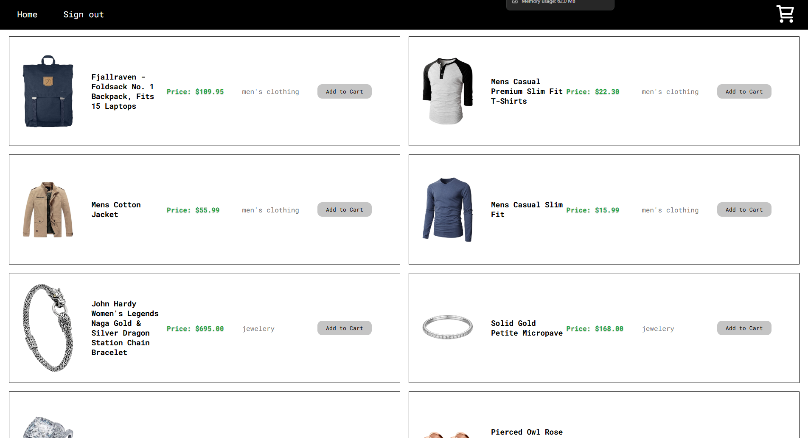

# E-Commerce App — Frontend

> A full-stack e-commerce client with product browsing, cart management, and checkout — built with React and Redux.

🔗 **[Live Demo](https://ecommerceclient-15f2.onrender.com/login)**



---

## Features

- 🛍️ **Product catalog** with category filtering
- 🛒 **Cart management** — add, update, remove items and checkout
- 🔐 **JWT authentication** with persistent sessions
- 🌀 **Animations** powered by Framer Motion
- 📱 **Responsive design**

---

## Tech Stack

| Technology | Purpose |
|---|---|
| React 18 | UI framework |
| Redux + Redux Persist | Global state & persistence |
| React Router v6 | Client-side routing |
| Axios | API requests |
| Framer Motion | Animations |
| Create React App | Build tool |

---

## Getting Started

### Prerequisites
- Node.js 20+

### Installation

```bash
git clone https://github.com/yaisnw/ecommerceclient.git
cd ecommerceclient
npm install
```

### Environment Variables

Create a `.env` file in the root directory:

```env
REACT_APP_BACKEND_URL=
```

### Running Locally

```bash
# Development
npm start

# Production build
npm run build
```

---

## Deployment

- **Frontend** — hosted on [Render](https://render.com)
- **Backend repo** — [ecommercebackend](https://github.com/yaisnw/ecommercebackend)
